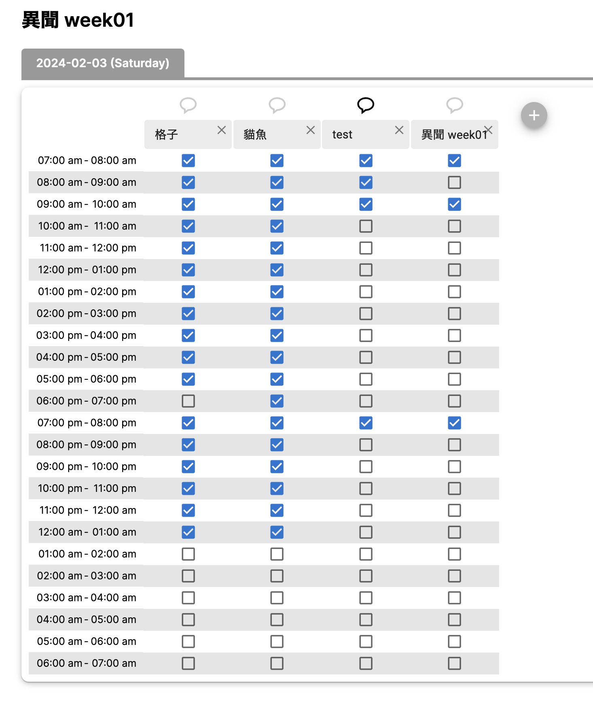
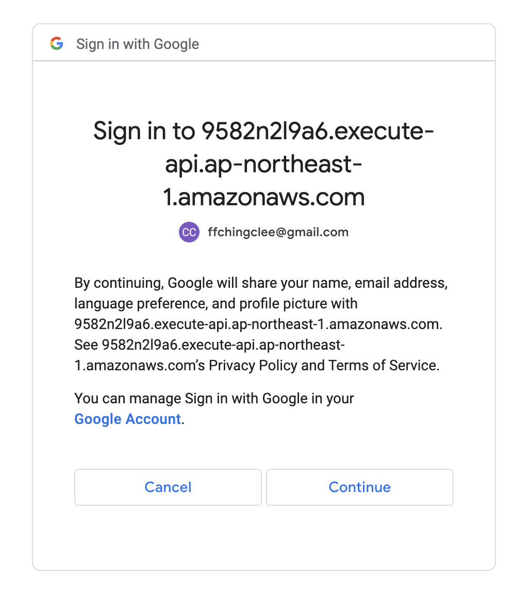

# How does it look?

# What is the Usage

This is a timesheet system written for determinng timeslots that are available for all member in a static team.

A functioning page has been deployed here:

- https://ffxiv-timesheet.vercel.app/timesheet

# About Login

## Why Login?

- Only the person who create timesheet needs to login. This is because we want to associate the timetable created by you with your account so that you can manage it.

- Logined user can:

  - Create events (we define `event` a set of `timetable`'s in a row for 1 week)
  - Delete events

## Who don't need to Login?

For people just to fill the timetable, however, their record can be altered by any people. So please just share the timetable link to related members.

## Way to Login

We use Google login.

The backend is held as a lambda function but since I have not purchased any domain, the login destination may seem weird:

which is actually the endpoint created by AWS lambda service, **_not anything malicious_**.
